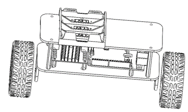
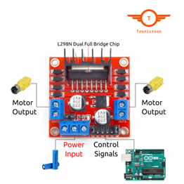

# Two-Wheel-Robot
In This Project, we implement a two wheel robot that can balance and move itself on different surfaces.

 <b> Course Project - Fall 2023    Contributors : R.S.Benny, S.Ahmadian, H.Farhood </b>

## Abstract:
This Project is divided in 3 Phases / Chapters :

In the First chapter the the Robot is designed using the powerful application Solid Works 2023. All of the consideratios, including the robot height, avoiding collision and its width are taken into account.

In the Second chapter we build the robot by assembling its components. Now that the main frame, the foundation of our robots are designed, we move to the next step : studying our components carefully, writing our code.

In the Third chapter a simulation based on the second configuaration which proves the most robust is created based on which the PID varibales are tuned. Formerly we tried to tune the PID based on intuition and guess. Now are model is created and the PID tuner service has come as savior to our hardship.

## Phase/Chapter 1 :
We make use of solid works 2023 to build our model of the robot. We First the plate, as we were able to download the mode of Arduino UNO and L298N -which are used in our project- from grabcad.com we designed our plates measurements based on that. Below there are two Pictures demonstring the measurements of the plate and the holes:

And Below you see hole placement:

(--For More Info please download the project report from the repository)

## Phase/Chapter 2 :
In This Chapter we get know our components better. The most integral components used in our project are :

- <strong>Arduino UNO</strong>:

The Arduino UNO is a popular microcontroller board based on the ATmega328P chip. It serves as the brain of your project, executing the programmed code to con-trol and coordinate the various components. It has digital and analog input/output pins, making it versatile for interfacing with sensors, actuators, and other electronic components.

- <strong>L298N</strong>:

The L298N is a dual H-bridge motor driver IC. It allows you to control the direction and speed of two DC motors independently. It's commonly used in projects involv-ing motorized devices such as robots and vehicles. The L298N interprets signals from the Arduino to drive the DC motors in the desired manner.

- <strong>2x DC Motors</strong>:

DC motors are electric motors that run on direct current. In your project, these mo-tors are likely responsible for providing movement to your robot or another device. The L298N motor driver facilitates the control of these motors by adjusting their speed and direction based on signals from the Arduino.

- <strong>3x 18650 Batteries</strong>:

18650 batteries are lithium-ion rechargeable batteries. They are commonly used in electronic projects due to their high energy density. In your project, these batteries likely provide the power source for the DC motors and other components. Ensure that the voltage and current ratings match the requirements of your motors and electronics.

(--For More Info please download the project report from the repository)

## Phase/Chapter 3 :
In this chapter , we implemented a simulation for our self balancing robot with simulink and simulink tools.
We use solver configuration which solves the system and mechanism   configuration which the gravity = G in +y direction is determined in it.
This configuration connects to a prismatic joints which is the wheels movements. And then after two rotations with rigid transform tool, configurations will connect to our system.
We use the rotations for having +y for gravity and Z axis for robot wheels movements.
As it can be seen we have two subsystems contain of body and motors and the wheel part. The revolute joint before motor and body subsystem connects wheel part to body part and percieve this connection as a revolute joint. We control our system with a pid controller and tuning these variables with MATLAB tuner tool.

- <strong>wheels</strong>:

For wheels implementation we use two identical variable cylinder solid to represent our wheels and two rigid transform blocks for determining the location of the wheels.

- <strong>Body</strong>:

In body and motors subsystem we implemented the two plates as two identical variable brick solid block and with rigid transform blocks we determine the location of the blocks. Moreover we implemented our four connecting screws as variable cylinders with diffrent location. also each motor is implemented as two connecting variable solid bricks. all of these forms the "body and motors" part which connect to wheels with a revolute joint
In this part we inserted an external force to the upper plate as an step function which will intentionally unstablize our system.

- <strong>PID controller</strong>:
For PID implementation first we determine the input and output of the controller. The input is the angle of the revolute joint(the angle between wheels and body) as radians which the gain -k- in the simulation converts degrees to radians.  The output is the force as (N) which will be applied to the prismatic joint(the movement of the wheel). we tune the PID block with MATLAB tuner block.

